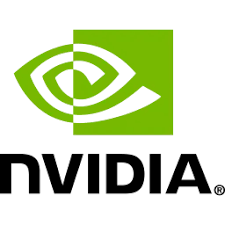
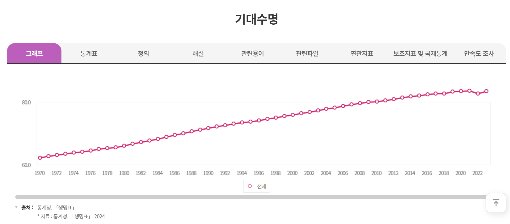
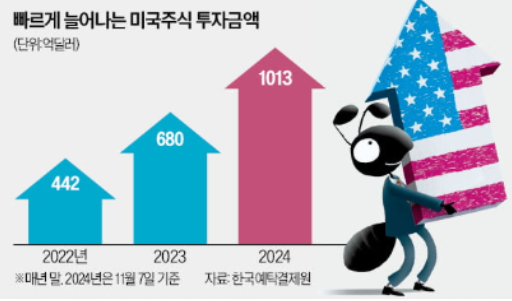
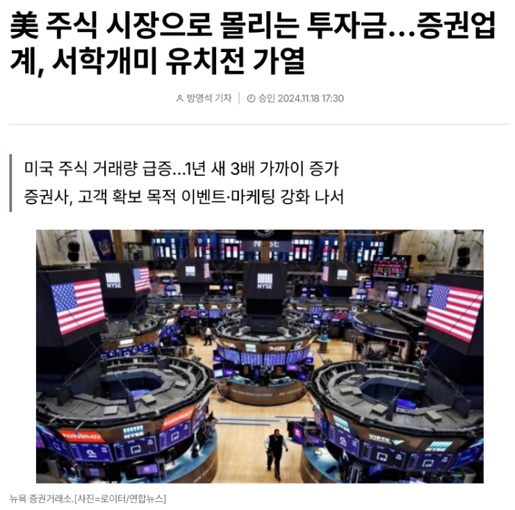
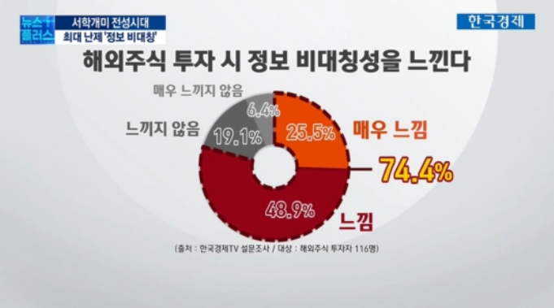
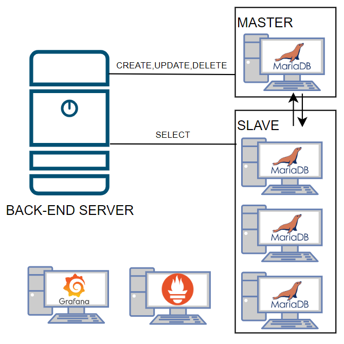
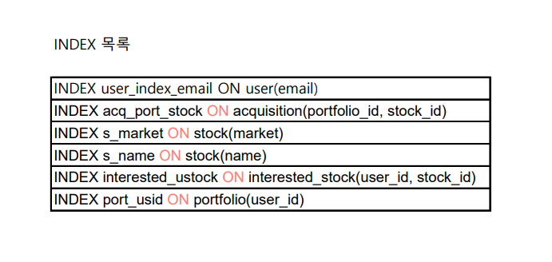
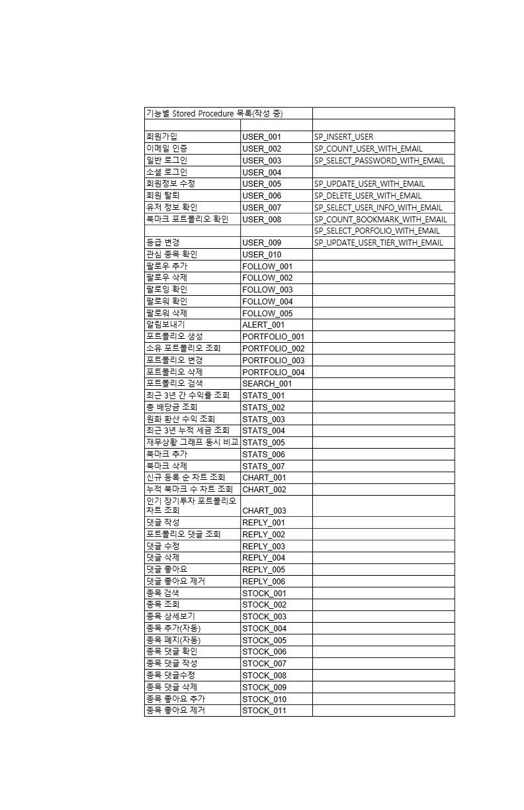

# 📈Across The Pacific (미국 주식 포트폴리오 공유 앱)

## 🗂️ 목차
1. [💻 기술 스택](#기술-스택)  
2. [🙆🏼‍♀️ 팀원 소개](#팀원-소개)
3. [📊 프로젝트 개요](#프로젝트-개요)  
   1.1. [소개](#1️⃣-소개)  
   1.2. [배경](#2️⃣-배경) 
4. [📁 요구사항 명세서](#요구사항-명세서)  
5. [📝 ERD 작성](#ERD-작성)  
6. [📰 시스템 아키텍처](#시스템-아키텍처)  
7. [🔧 DB 성능 개선](#db-성능-개선)  
8. [📄 기타 문서](#기타-문서)

## 💻 기술 스택

### ☑️ FRONT END

 

### ☑️ DB

 

##  🙆🏼‍♀️팀원 소개🙆🏼‍♀️
<table>
  <tbody>
    <tr>
      <td align="center"><a href=""> <b> 팀장: 김경준 </b></a> </td>
      <td align="center"><a href=""> <b> 팀원: 김혜정</b></a> </td>
      <td align="center"><a href=""> <b>팀원: 신지현</b></a> </td>
      <td align="center"><a href=""> <b>팀원: 이의범</b></a> </td>
      <td align="center"><a href=""> <b>팀원: 황경윤</b></a> </td>
  </tbody>
</table>

## 📊 프로젝트 개요
### 1️⃣ 소개
"모두가 함께 성장하는 투자 플랫폼 - Across The Pacific"

Across The Pacific은 미국 주식 투자 포트폴리오 공유 및 투자 전략 학습을 위한 소셜 기반 플랫폼입니다.  
> **목표**: 정보의 비대칭성을 해소하고, 개인 투자자들에게 투자 인사이트를 제공하여 함께 성장하는 투자 문화를 구축하는 것.

  
Across The Pacific 상세 소개

 Across The Pacific 은 사용자들이 자신의 미국 주식 투자 포트폴리오를 공유하고, 다양한 투자 전략과 정보를 교류할 수 있는 소셜 기반의 투자 플랫폼입니다. 사용자들은 자신의 투자 성과를 시각화하고, 기간별 수익률을 시뮬레이션할 수 있으며, 다른 투자자들의 포트폴리오를 참고하여 새로운 투자 기회를 탐색할 수 있습니다.

투자에 있어 '정보의 불균형'이 주요 문제로 지적되는 가운데, (앱 이름)은 사용자들이 자신의 투자 인사이트를 확장하고, 함께 성장할 수 있는 투자 커뮤니티를 제공합니다. 단순한 수익률 추적을 넘어, 사용자 간의 공유, 학습, 성장이라는 새로운 투자 문화를 형성하는 것이 이 서비스의 목표입니다.

### 2️⃣ 배경
#### 1. 제안 배경

 
  
 제안 배경 상세 소개

출처 : https://www.index.go.kr/unify/idx-info.do?idxCd=8016

한국 인구의 기대수명은 1970년 62.3세에서 2023년 83.5세로 약 21년 늘어났으나, 정년퇴직 나이는 여전히 법적으로는 60세에 그쳐, 이제 노동 소득뿐만 아니라 금융 소득을 가지는 것도 중요하게 되었습니니다. 그러나 대한민국 주식 시장의 제도 개선이 늦어지면서 장기적인 투자를 위해 자금 투입을 할 경우 안정적인 투자가 어려워, 많은 사람들이 활황을 보이는 미국 주식에 관심을 가지는 등 주식투자 성향이 다변화 되었습니다.

 Across The Pacific 서비스는 미국 주식 투자에 처음으로 발을 들이려는 이, 혹은 꾸준히 투자를 했으나 자신이 제대로 잘 하고 있는지 길라잡이가 필요한 사람들, 자신의 경험을 공유하고 타인에게 도움을 주려는 사람들이 서로 정보를 공유하는 서비스를 제공합니다.

1. 미국 주식 투자에 대한 관심 증가
최근 개인 투자자들의 미국 주식에 대한 관심이 급증하고 있습니다. 해외 주식 거래 플랫폼의 확산과 다양한 미디어의 주식 정보 제공으로, 더 많은 사람들이 해외 주식 투자를 시작하고 있습니다. 그러나 개인 투자자들이 적절한 정보를 얻고 효과적인 투자 전략을 수립하는 데 어려움을 겪고 있는 실정입니다.

2. 투자 정보의 불균형 해소 필요  
대형 투자 기관이나 전문 투자자들은 방대한 데이터와 분석 도구를 활용할 수 있지만, 일반 개인 투자자들은 제한된 정보와 소수의 투자 종목에 집중하는 경향이 있습니다. 이로 인해 투자 시야가 제한되고, 투자 기회를 놓칠 가능성이 큽니다.  Across The Pacific은 투자 포트폴리오의 공유와 피드백을 통해 개인 투자자들이 더 넓은 투자 시야를 가질 수 있도록 돕습니다.

3. 단순 기록을 넘어선 ‘투자 인사이트 제공’의 필요성
단순 기록을 넘어선 ‘투자 인사이트 제공’의 필요성 기존의 투자 앱들은 주로 투자 기록 관리나 수익률 확인에 국한되어 있습니다. 하지만, 사용자들은 단순한 수익률 조회가 아니라, 어떻게 투자 전략을 개선할 수 있는지에 대한 인사이트를 원하고 있습니다. (앱 이름)은 투자 전략을 구체화할 수 있는 기능으로 수익률 시뮬레이션, 포트폴리오 분석, 투자 전략 개선 제안 등의 기능을 제공합니다.

#### 2. Across The Pacific 서비스의 필요성

서비스 필요성 세부 사항

1. 타인의 주식을 참고해 투자를 시작하고싶으나 시작 정보를 어디서 얻어야할지 모르는 사람들이 많다.
2. 자신의 투자가 안정적인지, 현재 투자 상황의 위험도가 어느정도인지 정확히 인지하지 못하는 사람들이 있다.
3. 타인이 올린 투자 상황 및 시각 데이터가 얼마나 믿을만한지 신뢰성을 따지기 어렵다.

#### 3. Across The Pacific 서비스를 통한 해결 방안

  
서비스를 통한 해결 방안 세부 사항

1. 자신의 포트폴리오 작성 및 분석을 통해 자신의 투자 판단을 객관적인 시계열 데이터에 기반해 검증할 수 있다.
2. 분산투자를 장려할 수 있도록 시뮬레이션을 통해 명확하게 시각화된 정보를 제공한다.
3. 서로간의 투자 정보를 공유함으로써 정보 비대칭을 해소하는 데에 도움을 줄 수 있다.
4. 자신의 포트폴리오 공개를 장려하기 위해 분기 단위로 북마크 기능에 기반하여 인기 포트폴리오 순위를 선정해 많은 북마크 수를 가진 사용자들에게 분기별 인증 마크를 부여한다.

### 
<b>3️⃣ 시나리오</b>

 시나리오 1

1. 자신의 포트폴리오를 확인하려는 사용자(가명 김경준씨, 20살 주식 6개월 차)

친구따라서 주식을 시작하게된 김경준씨… 친구따라서 산 테슬라가 떡상하고 돈을 벌었지만 자신감이 넘쳐 바로 위험투자를 했다가 돈을 잃게된다. 조금 더 객관적으로 자신의 투자를 분석해야겠다는 생각이 들어 주식포트폴리오를 작성하고자 하였고 AP사이트를 방문하게 된다. 사이트 방문 후 개인 포트폴리오 작성 버튼을 누른다. 회원 가입을 하라는 사이트의 알림에 회원가입을 진행하고 로그인 후 개인 포트폴리오 작성을 시작한다. 우선 자신의 현재 돈을 적고 구입하고 팔았던 주식과 시기 가격을 작성하여 포트폴리오를 만든다. 해당 정보를 기입하니 자산변화 그래프와 구입했던 주식들 목록이 나오게 된다.

일주일 후 새롭게 애플 주식을 구입한 김경준씨 더 나은 주식 생활을 위해 포트폴리오를 꾸준히 작성하기로 하고 다시 사이트를 방문한다. 로그인을 하고 마이페이지로 들어가 내 포트폴리오 관리를 누른다. 저번주에 작성한 포트폴리오가 있었고 저번 주까지의 주식들의 총 변동량을 그래프로 보여준다. 변동을 확인하고 구매한 애플 주식을 추가하기 위해서 수정 버튼을 눌러 새롭게 구매한 주식의 정보를 적고 수정한다.

시나리오 2

2. 타인의 포트폴리오를 확인하려는 사용자(김경준씨)

자신의 포트폴리오를 작성했지만 더 뭘 사야할지 모르겠는 김경준씨는 남들이 어떻게 하는지 궁금해서 타인의 포트폴리오를 보기로 한다. 사이트의 포트폴리오를 클릭하니 인기순으로 정렬된 타인의 포트폴리오 목록이 나와서 찬찬히 둘러본다. 자신과 비슷한 사용자는 어떻게 구매를 했나 보려고 검색 버튼을 눌러 자신이 구매했던 테슬라와 애플 주식을 검색하니 현재 포트폴리오에 해당 주식을 가진 포트폴리오들이 인기순으로 정렬되어 나온다. 해당 포트폴리오를 클릭하여 포트폴리오 상새정보를 클릭해보니 자신이 목표로 하는 수익을 지난 기간동안 냈었고, 이를 참고하기 위해 북마크 버튼을 클릭해서 북마크에 등록하였다. 그리고 비슷한 다른 포트폴리오들을 확인해보니 수익이 좋은 사람들이 공통적으로 구매한 주식을 찾을 수 있었고 김경준씨는 그 주식을 구매하게 된다.

시나리오 3

3. 숨은 주식 고수 (가명 이의범씨, 50세, 주식 고수)

주식으로 월 300을 벌면서 경제적 자유를 이룩한 이의범씨는 회사를 은퇴하고 주식을 관리하게 된다. 자신의 포트폴리오를 등록해서 운영하던 와중에 자신의 포트폴리오의 북마크가 늘어나서 남들이 추천을 하니 기분이 좋아진다. 그리고 사이트에서 뱃지를 달아줘서 명예로워졌다. 그러자 당신의 프로파일을 주시하는 사용자가 늘어나 현재 4321명의 사용자가 당신의 프로파일을 팔로우하고 있다.

시나리오 4

4. 이번 분기 GOAT 포트폴리오 (가명 김혜정씨, 23세)

올해 8월에 자신의 주식 포트폴리오를 만들어 공개한 김혜정씨는 크리스마스에 홈페이지에 자신의 포트폴리오가 대문에 있는 ‘이번 분기의 인기 포트폴리오’에 1등으로 올라온 것을 보게 되었다. 혜정씨의 포트폴리오가 19720개의 북마크를 받아 4분기에서 가장 많은 북마크를 받은 것이다. 그리고 새해가 되자 다른 사람들이 혜정씨의 포트폴리오를 볼 때마다 작성자란 옆에 ‘202X년 4분기 인기 포트폴리오 제작자’ 마크를 볼 수 있게 되었고, 혜정님의 회원 등급이 1점 상승했다. 혜정씨는 다음 분기 포트폴리오를 잘 짜서 한 번 더 마크를 받는 데 도전하기로 한다.

## 📁 요구사항 명세서

 요구사항 정의서

## 📝 ERD 작성

## 📰 시스템 아키텍처

## 🔧 DB 성능 개선

 

 인덱싱 이미지

 

 

프로시져 이미지

 

👉🏼  [저장된 프로시져 파일]()

## 📄 기타 문서
[👉🏼 프로젝트 기획안](https://docs.google.com/document/d/10S8pPWJzgGtz6S1djeimFvKHkFpN2KdOCY7mrUeAtj4/edit?pli=1&tab=t.b3v4vsjloy9)

 

[👉🏼 요구사항 정의서](https://docs.google.com/spreadsheets/d/1woSNDRkSPBwEEkWzr27yUoJJfmwXYKzcMOCcOs6mO3c/edit?usp=sharing)